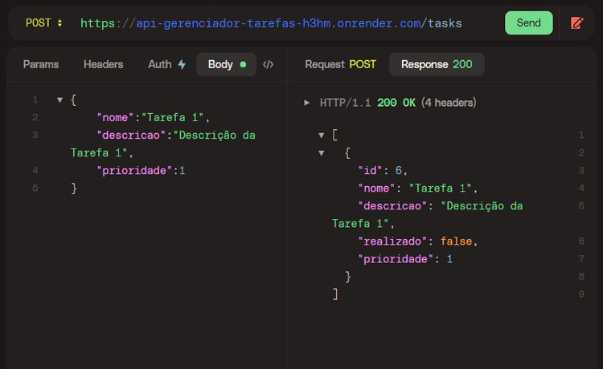
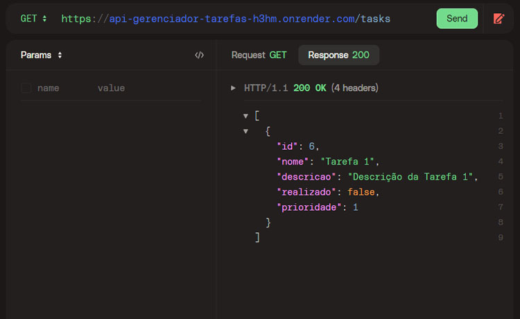
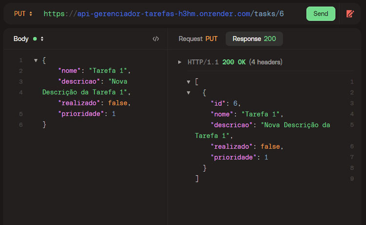
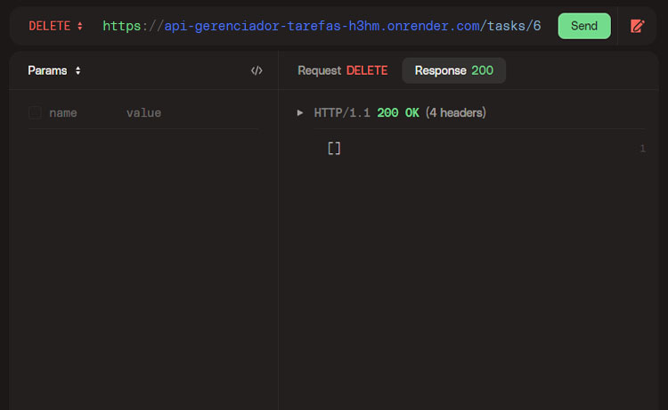

<h1 align="left">To-do List</h1>

Neste projeto foi desenvolvido uma API para gerenciar tarefas (CRUD).
Foram utilizadas as tecnologias **Java**, **Spring Boot**, **Spring MVC**, **Spring Data JPA**, **SpringDoc OpenAPI 3** e **banco de dados H2**.

<h3 align="left">📌 Práticas Adotadas</h3>

- API REST.
- Spring Data JPA para consultas.
- Tratamento de respostas de erro.
- Geração automática do Swagger com a OpenAPI 3.
- Uso do Docker para deploy na plataforma Render.

<h3 align="left">📌 Como Executar</h3>

- Clonar o repositório.
- Dentro do IntelliJ (ou da plataforma de sua preferência), instalar as depedências.
- Por fim, no arquivo da classe `ApiGerenciadorTarefasApplication`, executar o projeto.
- O Swagger poderá ser visualizado em [localhost:8080/swagger-ui.html](http://localhost:8080/swagger-ui.html)

<h3 align="left">📌 API Endpoints</h3>

Para realizar as requisições HTTP, foi utilizada a ferramenta [HTTPie](https://httpie.io).

Utilize a URL [], como nos exemplos abaixo.

- Criar Tarefa

- Listar Tarefas

- Atualizar Tarefa

- Remover Tarefa

